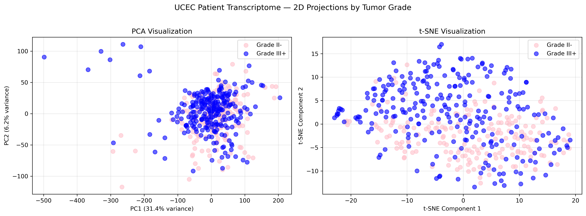

# UCEC Tumor Grade Classification from Transcriptomic Data

Binary classification of endometrial tumor grade (Grade II- vs Grade III+) using high-dimensional RNA-seq gene expression features from the TCGA UCEC cohort.

---

## Problem

Uterine Corpus Endometrial Carcinoma (UCEC) tumor grading has direct clinical implications for treatment decisions. Grade II- tumors are considered lower risk, while Grade III+ tumors are more aggressive. This project asks: can we predict tumor grade from transcriptome-wide gene expression alone?

- **444 training samples** x ~18,000 Ensembl gene-level features
- **110 held-out test samples** (no labels)
- Primary metric: **F1-score** (class imbalance makes accuracy insufficient)

---

## Approach

| Step | What was done |
|---|---|
| Data integrity | Shape checks, ID alignment, missing value confirmation, class balance |
| Model selection | Stratified 5-fold CV comparison: Linear, Logistic, Ridge, LASSO |
| Hyperparameter tuning | Alpha grid search for Ridge and LASSO (7 log-spaced values) |
| Feature selection | SelectKBest (ANOVA F-test) sweep over k in {100, 500, 1k, 2k, 5k, 10k} |
| Leakage prevention | All preprocessing fit inside CV folds via `Pipeline` |
| Sanity check | Y-randomization (100 trials) to confirm learned signal is real |
| Interpretation | Gene ranking by logistic regression coefficient magnitude |
| Visualization | PCA and t-SNE 2D projections colored by tumor grade |

**Best model:** Logistic Regression with StandardScaler, trained on all 444 samples for final predictions.

---

## Results

| Model | CV Accuracy | CV F1-Score |
|---|---|---|
| Logistic Regression | 82.2% | 0.846 |
| Linear Regression | 81.3% | 0.836 |
| Ridge Regression | 81.3% | 0.836 |
| LASSO | 80.4% | 0.828 |
| Y-randomization baseline | ~chance | ~chance |

SelectKBest feature selection sweep (Logistic Regression, 5-fold CV):

| k (features kept) | CV F1 |
|---|---|
| 100 | 0.772 |
| 500 | 0.798 |
| 1,000 | 0.789 |
| 2,000 | 0.832 |
| 5,000 | 0.843 |
| 10,000 | 0.849 |

Best configuration: Logistic Regression with top 10,000 features selected by ANOVA F-test (CV F1 = 0.849). Final model trained on all 444 samples.

PCA explained variance (PC1 + PC2): 37.56% -- consistent with high-dimensional transcriptomic data where no single linear projection captures most of the variance.
---

## Key Findings

- Logistic Regression consistently outperformed regression-based models on F1
- Y-randomization confirmed the model is picking up real transcriptomic signal, not statistical artifacts
- Top genes by coefficient magnitude include **PRLH** (prolactin-related, known endometrial cancer role) and **NTSR1/NTS** (neurotensin axis, reported in hormone-sensitive cancers), which partially recapitulates known UCEC biology

---
## Repository Structure

- `notebooks/` - main analysis notebook
- `data/` - raw feature matrices (not tracked, see note below)
- `results/`
  - `gene_importance.csv` - ranked gene coefficients from final model
  - `submission_final.csv` - final test set predictions
  - `patient_visualization.png` - PCA and t-SNE plots
- `requirements.txt`
- `.gitignore`
- `README.md`

> **Note on data:** Raw feature matrices are not tracked due to size. They can be obtained from the [TCGA data portal](https://portal.gdc.cancer.gov/)

---

## Visualizations

### PCA and t-SNE of Training Samples by Tumor Grade



Classes overlap considerably in 2D projections, consistent with the high-order nature of tumor grade as a phenotype. The linear classifier finds a useful decision boundary in the full ~18K-dimensional space despite the apparent lack of 2D separation.

---

## Setup and Reproduction

\```bash
git clone https://github.com/zahinp7/ucec-tumor-grade-classification.git
cd ucec-tumor-grade-classification
pip install -r requirements.txt
\```

Place the three data files in `data/`, then run:

\```bash
jupyter notebook notebooks/ucec_tumor_grade_classification.ipynb
\```

---

## Dependencies

See `requirements.txt`. Core stack: `scikit-learn`, `pandas`, `numpy`, `matplotlib`.

---

## Skills

- End-to-end ML pipeline design in scikit-learn
- Stratified cross-validation and Pipeline-based leakage prevention
- Feature selection in high-dimensional (n << p) biological data
- Model interpretability via coefficient analysis
- Dimensionality reduction (PCA, t-SNE) for exploratory data analysis
- Biological validation of model outputs against domain literature
